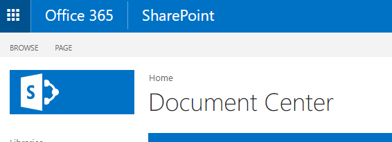
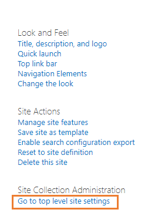
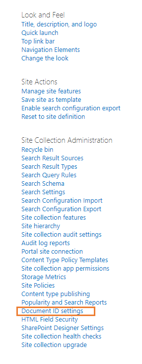

# SharePoint Site

CCH iFirm Document Manager relies on a configured SharePoint Site to operate properly and the provisioning tool assists with its configuration. 

The following section details the configuration of the SharePoint Site and what the various configurations do.

## Document Center

The Document Center site contains all client documents and templates.

### Documents Library

The Documents Library is a standard SharePoint document library except:

1. The ```Clients``` folder is critical. It must be be named ```Clients``` and is case sensitive. All client folders will be created by the system under this.
2. The **Content Organizer** is enabled but not configured.
3. Versioning is enabled, but the requirement for check-in and check-out is not.

### Document ID Service

The Document ID Service is enabled and creates a unique ID for each document.

To configure the ID Service to be more user friendly:

1. Navigate to the Document Center.
    
2. Click the **Settings Cog** in the top right and choose **Site Settings**
    
3. Choose **Go to top level site **settings**** under **Site Collection Administration**
    
4. Choose **Document ID settings** under Site Collection Administration
    
5. Change the characters to something meaningful and select **Reset all Document Ids** in this Site Collection to begin with these characters tick box. 
   > Please note, we recommend changing this as soon as you configure the new SharePoint site and advise against changing at a later date. If you are unsure or would like to change the Document ID settings, please contact your systems administrator.
   

### Content Organizer
The Content Organizer is a legacy SharePoint feature and is enable but not configured in CCH iFirm Document Manager.

### Lists
Lists store key information that allow the various applications to function correctly. 

The following lists exist:

- HubOne Common App Settings - This contains global configuration of the CCH iFirm Document Manager application.
- Clients - This contains the list of clients for the organisation
- Jobs - *Future list for expansion*
- Contacts - *Future list for expansion*
- Suppliers - *Future list for expansion*
- Tasks - *Future list for expansion*

#### HubOne Common App Settings
The Common App Settings Table contains configuration for all CCH iFirm Document Manager apps and is established via the Provisioning tool.

These settings should not be altered after the initial configuration by the provisioning tool. If you would like to make a change, please contact your system administrator. 

The settings can be modified and are as shown below:

| Setting | Options | Description |
| -- | -- | -- |
| ```ModernPractice_FolderConfig``` | ```Standard``` or ```Alphanumeric``` | Standard is where all client folders are listed directly under the main Clients folder. Alphanumeric means there are subfolders under the Clients folder (0-9 and A through Z) - this is typically used where total Clients > 5000 or may exceed 5000. |
| ```ModernPractice_UseSubFolders``` | ```True``` or ```False``` | If True, the option to choose subfolders will appear in apps. If False, it will not. |
| ```ModernPractice_ServiceLocation``` | ```AU``` or ```NZ``` | This setting is now obsolete. It was used to work with AU or NZ XPM, Xero Tax or WorkflowMax Accounts. |
| ```OP_UserSharePointLists``` | ```True``` | Ensures the apps will use SharePoint Lists as the data source. | 
| ```OP_AllowAmpersands``` | ```True``` or ```False``` |If False, all names from the Practice Management system that contain the ampersands character (&), will be replaced with the word and. |
| ```RefreshClientListFrequency``` | ```0```-```90``` | The number (in days) between the auto refresh of client lists. If 0, the client list will not refresh automatically. |
| ```Skin``` | ```CCH```, ```CAKairos```, ```OnePractice``` | The look and feel of the applications. |
| ```PopulateClientMetadataField``` | ```True``` or ```False``` |If True, it will attempt to populate the Client Metadata field on Save. |
| ```PopulateGroupMetadataField``` | ```True``` or ```False``` | If True, it will attempt to populate the Group Metadata field on Save. |
| ```RefreshListFrequency``` | ```0```-```90``` | The number (in days) between auto refresh of lists. If 0, the lists will not refresh automatically. |
| ```DoNotShowMetadataColumns``` | ```Client, ClientGroup, Group1``` | This will prevent the metadata columns listed from appearing in the individual apps. You can edit this item to add more metadata columns. Ensure you use commas to separate the values. |

#### Refresh List Freqyency Setting


All of the applications store a cache of all your clients and jobs in your local browser after its first load. This is to minimise loading time and to give you a more efficient experience. However, this means that from time to time you will need to refresh your clients and jobs lists to reflect changes in your data source (e.g. Xero Practice Manager, SharePoint or another source).
 
You can do this manually by clicking the Refresh icon in the application header bar or you can set a refresh schedule in your HubOne Common App Settings list in your SharePoint Document Center.
 
Updating the HubOne Common App Settings
 
1. Open your SharePoint Document Center > Settings Cog > Site Contents > HubOne Common App Settings (list)
2. Click Quick Edit
3. Scroll down until you find the line item RefreshListFrequency
4. In the SettingValue column, set its value to:
    1. “0” if you wish to never refresh or only refresh manually or;
    2. A number value (1 – 100) to indicate the number of days between each automatic refresh.
 
Once the application passes the desired refresh schedule time, it will automatically refresh and reload your clients and jobs lists from their respective data sources. Please be patient if your data source is large.
 
Please note, you must contact your systems administrator prior to making any changes.


The Clients list contains information regarding clients in the practice management system and consists of the following fields:

| Title |
| -- |
| Client Name
| Client ID
| Date Of Birth
| Email
| Phone
| Primary Contact Name
| Primary Contact Addressee
| Primary Contact Salutation
| Primary Contact Email
| Primary Contact Mobile
| Primary Contact Phone
| Tax Number
| Partner
| Manager
| Client Group
| BankAccountName
| BankBSB
| BankAccountNumber
| Post Code
| Postal Address
| Postal City
| Postal Country
| Postal Post Code
| Postal Region
| Address
| Region
| City
| Country
| Post Code
| Business Number
| Company Number
| Prepare GST
| Primary Contact Position
| Referral Source
| Website
| Export Code
| Signed Tax Authority
| GST Registered
| Agency Status
| Is Archived
| Is Prospect
| Account Manager ID
| Account Manager Name
| Job Manager ID
| Job manager Name
| is Deleted
| Bank Name

### Subfolders in the Document Center

Our applications utilise SharePoint's own search functionality to load subfolders from a client folder in your SharePoint Document Center. This allows our applications to bypass some of the limits imposed by SharePoint on the number of subfolders that can be placed under a particular folder. However, this comes with a few limitations at the moment:

1. If you add a new folder under a client folder in SharePoint - you will need to add a file under this folder (it can be anything) for SharePoint Search to be able to index the folder and recognise it.
2. You will need SharePoint to re-index your site, which it does every hour or two before the folder will appear in the applications.
3. You will need to manually refresh each application by clicking the refresh icon or wait for the app to refresh according to your RefreshListFrequency setting in HubOne Common App Settings list in your document center.

