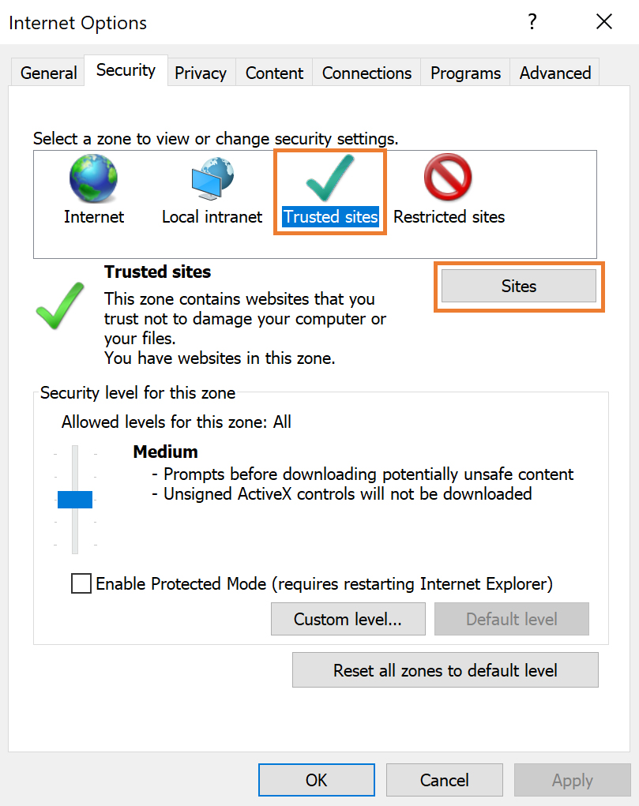

# Getting Started

## Internet Explorer Configuration for OnePractice

To ensure your Office 365 experience and OnePractice performance is as responsive as possible, please ensure that then following configuration is applied to Internet Explorer.

1. In Internet Explorer, click the icon of the cog in the top right hand corner.
   
2. Select Internet Options from the drop down menu.
3. Click on the Security tab.
4. Select the Trusted Sites icon and then click the Sites button
   
5. Add the following sites to the Trusted Sites list:
    - https://*.o365apps.net
    - https://*.sharepoint.com
    - https://*.microsoftonline.com
    - https://*.microsoft.com
    - https://outlook.office.com
    - https://outlook.com
    - https://*.onepracticetemplatemanager.azurewebsites.net
    - https://mpp4mailman.azurewebsites.net

6. Click Close to return to Internet Options.
7. Select the Connections tab.
8. Click on the LAN Settings button.
9. Untick the Automatically Detect Settings checkbox.

**Internet Explorer configuration is now complete.**

## How do I Install OnePractice?
- Follow the guide [here](provisioning.md).

## Switching to Xero Practice Management

If your company is switching to Xero and you are already using the OnePractice software suite you will need to make a couple of simple changes to redirect the software to your new data source. Provided your clients lists have already been migrated to Xero you will need to perform the following steps:

1. Open the HubOne Common App Settings list in your OnePractice Document Center
2. Change the OP_UseSharePointLists setting to "True" (without the quotes - case-sensitive)
3. Navigate to Enter your Xero Practice Management unique account key in the TemplateMan_WorkflowMaxAccountKey setting.
Click the refresh button in each of the OnePractice applications to reload your clients from the new datasource.

## Support Desk First Contact

As a support desk technician you will often be presented with users creating tickets with unhelpful comments like "It doesn't work" or "The app is broken" without supplying any details to help you start your investigation. So before you fire back with the ever popular "Is your computer plugged in?" take a deep breath and ask the user these simple questions to get you going

1. Is your computer plugged in? (just kidding)
2. In which application are you experiencing the issue e.g Templates, Mail, Scans or Mail Templates
3. Is it a single user experiencing the issue or company wide?
4. In which host environment was the application running - browser or desktop?
    - and if browser - which browser?
5. What version of Windows is the user running?
6. If the application is Mail or Mail Templates - what version of Outlook? Is it the latest version from Office365?
7. What was the user doing prior to receiving the error? What action did they perform? *This is for us to try and reproduce the error on our side*