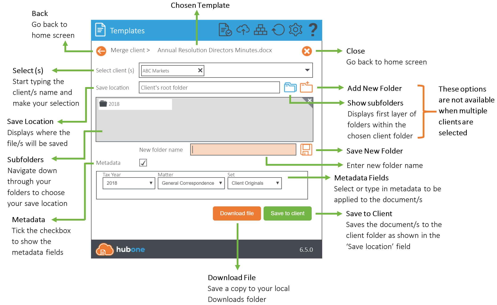

# Templates

Templates provides you with a central template store within your SharePoint Document Center so you can have a unified and consistent approach to work, reduce human error and produce documents far faster than ever before. 

Unlike many other template tools, Templates facilitates powerful and easy integration between Microsoft Office Word or Excel documents, and client or job data from your CRM or Practice Management software, thereby saving even more of your time.

Templates allows you to create templates with an easy-to-use tag builder extracting from data sources and share instantly with your team. From there, you can produce documents in seconds.

As well as automatically populating pre-defined fields, you can prompt users to input ad-hoc information before the document is filed into the specific client folder in SharePoint.

What’s more, Templates appears by default on your Document Center and incorporates seamless automatic updating so you always have the latest version available.

- [Templates](#templates)
  - [Getting Started](#getting-started)
  - [How do I create a Document?](#how-do-i-create-a-document)
    - [Watch the Video Tutorial](#watch-the-video-tutorial)
    - [Creation Screen Navigation](#creation-screen-navigation)
  - [Templates Supported File Types](#templates-supported-file-types)
  - [Renewing Templates ClientSecret Tokens](#renewing-templates-clientsecret-tokens)

## Getting Started

Templates is installed by default on the homepage of your SharePoint Document Center.

On first run, the application will load your clients and jobs lists and store (cache) them locally in your browser for quick access later on. Please be patient, as this can take up to a minute depending on the volume of data. Once this process completes, the application will notify you if there are no templates in your templates directory.

To locate or add templates, click on the Upload Templates button and you will be redirected to the Modern Practice Templates folder.

You can also navigate there as follows:

Settings Cog (as shown below) > Site Contents > Modern Practice Templates.


Any MS Word .docx or Excel .xlsx document placed in this directory will appear in the Templates app (after clicking refresh in the controls bar of the Templates).


If you organise your templates into folders, this will also display in the Templates app. 


## How do I create a Document?
### [Watch the Video Tutorial](https://youtu.be/adPlaHxaxQI)

### Creation Screen Navigation



[Step by Step Guide]()

## Templates Supported File Types
Templates requires all files to be saved in the latest version of Office 365. 

Currently Templates only supports Word (.docx) and Excel (.xlsx) files.

If your file has been saved as .doc  or .xls, you must resave as the newer versions stipulated above.

For email templates, see here.
## Renewing Templates ClientSecret Tokens

Templates relies on a secure client token from Azure to operate. These client tokens expire every 1 to 2 years depending on the setup. Once a token expires, Templates will generate an error until the token is renewed. 


To renew the token, please contact your systems administrator/IT partner to complete the following steps:

1. Ensure you have administrator rights over the SharePoint tenancy
2. Download Powershell script
```powershell


#-----------------------------------------------------------------------------------
#--This script will remove existing / expired ClientSecret tokens for
#--Template Manager and install new ones with an expiry date of 6 years from time of running
#--You will need to add your SharePoint administrator credentials when prompted
#-----------------------------------------------------------------------------------

Clear-Host
Set-ExecutionPolicy -Scope CurrentUser -ExecutionPolicy Unrestricted

#Checking if MSOLService is installed, if not install it
if (-Not (Get-Module -ListAvailable -Name MSOnline)) {
    Write-Host "MSOnline module not installed. Installing MSOnline"
    Install-Module MSOnline
    } 

#Checking if SPOService is installed, if not install it
if (-Not (Get-Module -ListAvailable -Name Microsoft.Online.SharePoint.Powershell)) {
    Write-Host "SPOnline module not installed.  Installing SPOnline"
    Install-Module Microsoft.Online.SharePoint.Powershell
    } 

Import-Module Microsoft.Online.SharePoint.Powershell -DisableNameChecking 

#the client id of Template Manager application
$clientId = '894367b3-6a82-40f4-9d9b-b9b85ed5f96a'

#the new client secret to be installed
$newClientSecret1 = 'i4BaLQ2jRj9+VjYVE5EWDPS9oh4HvcVgSNRIVsVvJY4='
$cred = Get-Credential

Write('Connecting to SharePoint tenancy...')
Connect-MsolService -Credential $cred

Write('Preparing to retrieve expiring access keys to One Practice Template Manager and remove them...')
$keys = Get-MsolServicePrincipalCredential -AppPrincipalId $clientId -ReturnKeyValues $true | Where-Object { ($_.Type -ne "Other") -and ($_.Type -ne "Asymmetric") }
foreach($kk in $keys){
    Write ($kk)
    Remove-MsolServicePrincipalCredential -AppPrincipalId $clientId -KeyIds @($kk.KeyId)
}

Write('Checking all keys removed...')
$keysCheck = Get-MsolServicePrincipalCredential -AppPrincipalId $clientId -ReturnKeyValues $true | Where-Object { ($_.Type -ne "Other") -and ($_.Type -ne "Asymmetric") }

Write('Installing new keys with expiry of 6 years...')
$dtStart = [System.DateTime]::Now
$dtEnd = $dtStart.AddYears(6)
New-MsolServicePrincipalCredential -AppPrincipalId $clientId -Type Symmetric -Usage Sign -Value $newClientSecret1 -StartDate $dtStart  –EndDate $dtEnd
New-MsolServicePrincipalCredential -AppPrincipalId $clientId -Type Symmetric -Usage Verify -Value $newClientSecret1   -StartDate $dtStart  –EndDate $dtEnd
New-MsolServicePrincipalCredential -AppPrincipalId $clientId -Type Password -Usage Verify -Value $newClientSecret1   -StartDate $dtStart  –EndDate $dtEnd

Write('Getting keys again after adding new...')
$keys2 = Get-MsolServicePrincipalCredential -AppPrincipalId $clientId -TenantId $theTenantId -ReturnKeyValues $true | Where-Object { ($_.Type -ne "Other") -and ($_.Type -ne "Asymmetric") }
foreach($kk in $keys2){
    Write ($kk)
}

Write('REMEMBER IN SOME CASES YOU MAY NEED TO WAIT UP TO 12 HOURS FOR CHANGES TO PROPAGATE!!') 
```

3. Run the Powershell script against the tenancy - this will remove existing expired tokens related to template manager and install new ones with an expiry of 6 years.
4. Wait up to 12 hours for the changes to propagate
5. Check Templates functionality returns to normal


