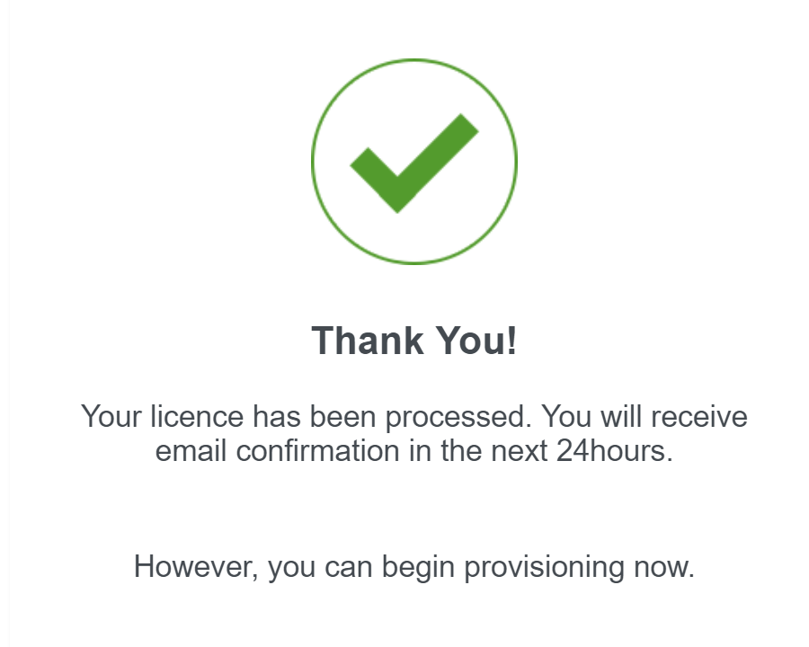
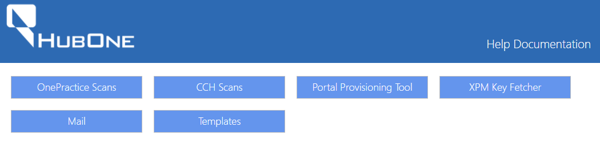
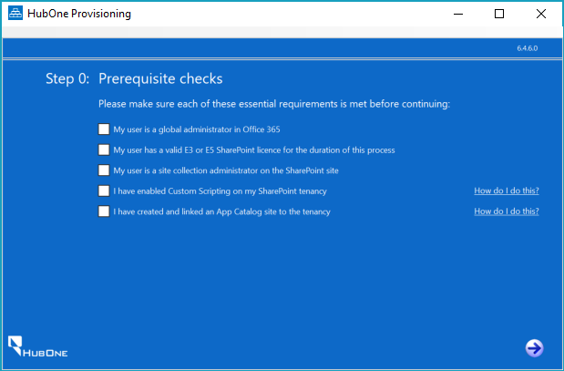
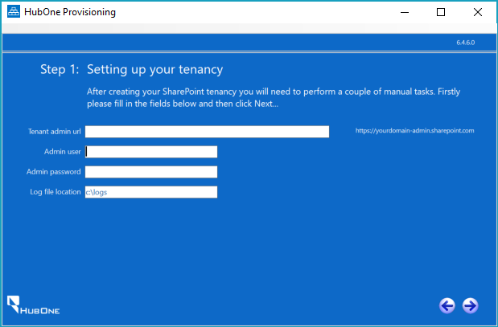

# Provisioning

[Home](introduction.md)

## In this Section

- [Provisioning](#provisioning)
  - [In this Section](#in-this-section)
- [Puchasing & Licensing](#puchasing--licensing)
- [Installation of Pre-Requisites](#installation-of-pre-requisites)
- [Provisioning Process](#provisioning-process)
- [Post Provisioning](#post-provisioning)

Provisioning involves the installation and configuration of <%PRODUCT_NAME%> in an existing Office 365 environment. This process is only performed once, and is used to automatically perform configuration of the SharePoint Site Collection and other items.<%PRODUCT_NAME%> requires a clean SharePoint Online Site Collection and will use the root site. 

Whilst the provisioning process does not delete files, it may change the look and feel of an existing chosen site collection, so take care when implementing it.

The following sections detail the steps to provision <%PRODUCT_NAME%>:

- **[Purchasing & Licensing](#puchasing--licensing)** - Contains information on how to purchase and license <%PRODUCT_NAME%>.
- **[Installation of <%PRODUCT_NAME%> Prerequisites](#installation-of-pre-requisites)** - Step by step instructions on the installation of pre-requisites for your office 365 enviroment.
- Provisioning Process
- Post Provisioning

# Puchasing & Licensing

Staff are able to immediately license <%PRODUCT_NAME%> for their clients domain. This process will immediately apply a license and allow you to continue.

Once you have done so, you can follow the below instructions which will immediately apply the license and allow you to continue.

In order to license <%PRODUCT_NAME%>, please follow the procedure below.

| Step | Instructions | Screenshot |
| -- | -- | --: |
| 1. | Navigate to the [License form](https://form.jotform.co/73236397529871) Enter the Customer's Business Name. Enter the SharePoint URL (Leave off https:// or http://). Enter the Partner Name. Enter the number of seats or users the customer has. Click **Submit.** |  |
| 2. | Once submitted, you can continue with the provisioning process via the app. |  | 

# Installation of Pre-Requisites

The following procedure details how to install <%PRODUCT_NAME%> prerequisites.

| Step | Instructions | Screenshot |
| -- | -- | --: |
| 1. | Navigate to http://software.hubone.com Click Portal Provisioning Tool |  |
| 2. | Click **Download Application** |  |
| 3.  | The Application will download as a Zip File. Once it has downloaded, click the Zip File |  |
| 4. | Click **Extract all** in the zip file. Once the files have been extracted, double click **setup**. |  |
| 5. | If you see the error message as displayed to the right, navigate to https://msdn.microsoft.com/en-us/library/ee308453.aspx for instructions on how to resolve. |  | 
| 6. | If the Windows Defender dialog appears, click **More Info** |  |
| 6a. | If you clicked **More Info** in step 6 above, click **Run Anyway** |  |
| 7. | Click **Install** |  |
| 8. | The <%PRODUCT_NAME%> Provisioning Portal will download and install. When complete, there will be a pause and the dialog will disappear. | | 
| 9. | Shortly after, the <%PRODUCT_NAME%> Provisioning Manager will run. |  |
| 10. | If you are using the user you created in Part 1, you can mark that the user is a global administrator. If not, please confirm the user account you are using is a global administrator. | |
| 11. | Ensure your user has a valid Office 365 licence. You can check this by navigating to https://portal.office.com/adminportal/home#/users and reviewing the user's role. If they do not have a licence, assign an E3 or E5 licence. Wait 30 minutes for Microsoft to apply the licence, then continue to step 12. | |
| 12. | Mark that your user has a valid E3 or E5 Licence. | |
| 13. | Ensure your user is a SharePoint Site Collection Administrator. This will be true if you set up a new tenancy or if they are a Global Administrator and have been granted site administration permissions in the Sharepoint admin center. | |
| 14. | Next, enable Custom scripting on the SharePoint Library. Please note, step 15 assumes you do not have the required components installed. | |
| 15. |To enable custom scripting, click How do I do this? to obtain a set of instructions. Once you have the required components, these instructions assume you have some proficiency in the use of PowerShell. Once you have completed those instructions, mark the check box. | |
| 16. | Next, you need to create an App Catalog.  Click How do I do this? next to the App Catalog checkbox to obtain a set of instructions. Once you have completed those instructions, mark the check box. | |

# Provisioning Process

The following steps complete the installation of <%PRODUCT_NAME%>.

| Step | Instructions | Screenshot |
| -- | -- | --: |
| 1. | Click the Right Arrow at the bottom. |  |
| 2. | Enter the following Information: **Tenant Admin URL** - The Admin Link for the Client's SharePoint Site **Admin User** - A Global Admin user login e.g. admin@<designator>.onmicrosoft.com **Admin Password** - The user's password **Log File Location** - The provisioning tool produces comprehensive logs. Choose a location to store them.  Once complete, click the Right Arrow at the Bottom. | | 
| 3. | The Provisioning tool will check the Office 365 environment and permissions. Once complete, the next screen will appear. Select SharePoint. Using a Live Practice Management System Instance Make sure 'sample data' checkbox is not checked. |  |
| 4. | Accept the defaults for portal URL, Document Center URL and Display Name. Complete the following: **Configuration  & Skin** - Choose the appropriate skin. **Company Specific Settings** - Upload the Customer Logo and Change the Helpdesk URL to your company's helpdesk URL. Once done, adjust the time zone. **Metadata** - Add any desired Metadata fields. **Common App Settings** - leave as default Once done, click the Right Arrow. |  |
| 5. | The application will commence creating the portal. |  | 
| 6. | The screen to the right will appear. Carefully follow the instructions on the screen. WARNING: Failure to follow the instructions will result in a unsuccessful implementation. Then click the arrow to the right. | 

7
The application will continue to configure the environment. 

Wait until it has completed, then close the application.

8
Download the CCHOnePractice Mail Manifest from
http://software.hubone.com/MailManager/

9
Navigate to Exchange Administration:
https://outlook.office365.com/ecp

Then click Organization.

10
Click add-ins.

Then click the + button and select Add from File.

11
Click Choose File.

12
Browse for the manifest you downloaded in step 8.

Click Next and wait for the file to upload.

13
Once done, Mail appears in the list.

14
Double click Mail and choose Mandatory, always enabled. 

Once done, click Save.

*** PROCEDURE COMPLETE ***

# Post Provisioning
Once you have completed provisioning, you can install Scans on Computers which require it.